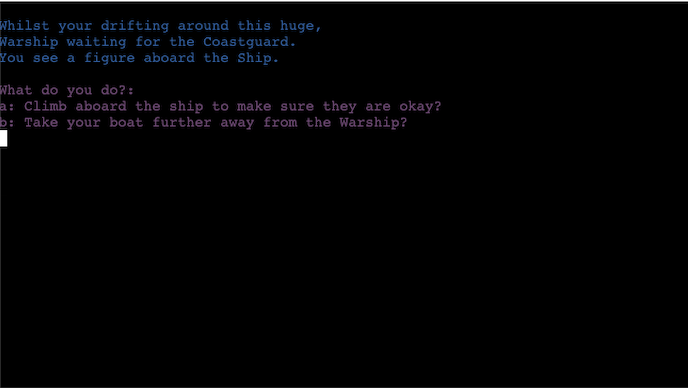

# Warship


Warship is a Python terminal game, which runs in the Code Institute mock terminal on Heroku.

Users answer questions in the game, which will determine the users next path. The game, whilst terminal-based, is aimed to use the players imagination to envision the scenario.

Here is the [live version](https://warship-app.herokuapp.com) of my project.


## How to play

Warship is a text-based game which have been documented to go back since the 1960's. You can read more about them and their paths through history on [Wikipedia](https://en.wikipedia.org/wiki/Text-based_game).

In this game we use multiple choice questions to lead the user down a path either further into the ship, with or without friends.

There is no winning or losing, but more the users want to go further into the Warship.

## Features

### Existing Features

* Use of **[colorama](https://pypi.org/project/colorama)**
    * The use of colorama has been implemented to enable quick and easy viewing if something is incorrect in RED
    * Using BLUE for the use of information for the user
    * Using YELLOW for standout information like, the selection choice


* The Story behind Warship


* Use of the `clear()` function to clear the users terminal during the game play

```python
import os

def clear():
    """
    Clear function to clear up the terminal
    """
    os.system('cls' if os.name == 'nt' else 'clear')
```



* Refactoring of code
    * Removing the five End Game Function and combining into one function
    * Adding the Final End game function into the End Game function


* Displaying Errors when the user inputs the wrong information


### Future Features

* To allow users to set usernames
* Adding in Terminal Based Graphics


## Data Model

I decided to use a Adventure game for my model, meaning that when the user answers the questions they have different paths, leading to different outcomes.

The number of questions I wanted to limit, to keep the game quick and fun, but also have multiple outcomes so it can be played more than once.

## Flowcharts

* Used a flowchart of the questions to follow the path through with the answers of the questions.


* The questions where set out with the answers, color coded to link through:


## Testing

To view all testing documentation, please refer to the [TESTING.md](TESTING.md) file.

## Deployment

This project was deployed using Code Institute's mock terminal for Heroku.

* Steps for deployment:
    * Fork or clone this repository
		- `git clone https://github.com/benjimansutton/warship.git`
    * Create a new [Heroku](https://www.heroku.com) app
    * Set the buildpacks to `Python` and `NodeJS` in that order
    * Link the Heroku app to the GitHub repository
    * Click on **Deploy**
	* Make sure to freeze the requirements.txt file
		- `pip3 freeze --local > requirements.txt`

### Local Deployment

In order to make a local copy of this project, you can clone it. In your IDE Terminal, type the following command to clone my repository:

- `git clone https://github.com/benjimansutton/warship.git`

You will also need to install the required packages from the [requirements.txt](requirements.txt), and you can do that using this command:

- `pip3 install -r requirements.txt`

Alternatively, if using Gitpod, you can click below to create your own workspace using this repository.

[](https://gitpod.io/#https://github.com/benjimansutton/warship)

## Credits

* Code Institute for the [deployment terminal](https://github.com/Code-Institute-Org/python-essentials-template).
* [Wikipedia](https://en.wikipedia.org/wiki/Text-based_game) for the details of Text-based games.
* [amiresponsive](http://ami.responsivedesign.is/) for the mockup responsive image.
* [StackOverflow](https://stackoverflow.com/questions/2084508/clear-terminal-in-python) for writing the `clear()` function.
* [YouTube](https://www.youtube.com/watch?v=u51Zjlnui4Y) for using the **colorama** Python package.
* [pypi](https://pypi.org/project/colorama) for **colorama**.

Thank You! - [Benjiman Sutton](https://github.com/benjimansutton)
