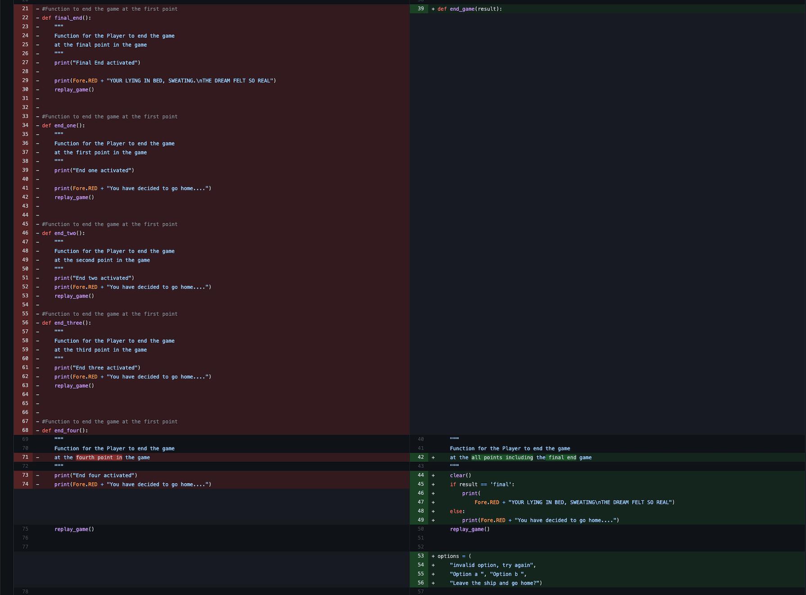

# Warship
​
Warship is a Python terminal game, which runs in the Code Institute mock terminal on Heroku
​
Users answer questions in the game, which will determine the users next path. The game, whilst terminal based is aimed to user the players imagination to envision the scenario.
​
[Here is the live version of my project.](https://warship-app.herokuapp.com/)
​

​
## How to play
​
Warship is a text-based game which have been documented to go back since the 1960's. You can read more about them and their paths through history on [Wikipedia](https://en.wikipedia.org/wiki/Text-based_game).
​
In this game we use multiple choice questions to lead the user down a path either further into the ship, with or without friends.
​
There is no winning or losing, but more the users want to go further into the Warship.
​
## Features
​
### Existing Features
​
* Use of Colorama
    * The use of colorama has been implemented to enable quick and easy viewing if something is incorrect in RED
    * Using BLUE for the use of information for the user
    * Using YELLOW for standout information like, the selection choice
​

* The Story behind Warship
​

* Use of the clear function to clear the users terminal during the game play
​

​
* Refactoring of code
    * Removing the five End Game Function and combining into one function
    * Adding the Final End game function into the End Game function
​

​
* Displaying Errors when the user inputs the wrong information
​

### Future Features
​
* To allow users to set usernames
* Adding in Terminal Based Graphics

​
## Data Model
​
I decided to use a Board class as my model. The game creates two instances of the Board class to hold the player's and the computer's board.

I decided to use a Adventure game for my model, meaning that when the user answers the questions they have different paths, leading to different outcomes
​
The number of questions i wanted to limit, to keep the game quick and fun, but also have multiple outcomes so it can be played more than once

## Testing

* Testing document
​

​
I have manually tested this project by doing the following:
​
* Passed the code through a PEP8 linter and confirmed there are no problems
* Given invalid inputs: strings when numbers are expected, out of bounds inputs, same input twice
* Tested in my local terminal and the Code Institute Heroku terminal
​
### Bugs
​
#### Solved Bugs
​
* When I wrote the project, I was getting errors that where linked to functions not calling due to indentation errors
* My 'replay_game' function was not calling due to an error with the 'if' statement as i was calling an 'else' instead of an 'elif' statement first
​
### Remaining Bugs
​
* No bugs remaining that I'm aware of.
​
### Validator Testing
​
* PEP8
    * Errors were returned from PEP8online.com
	 app
    * Set the buildpacks to `Python` and `NodeJS` in that order
    * Link the Heroku app to the GitHub repository
    * Click on **Deploy**
	* Make sure to freeze the requirements.txt file
		- `pip3 freeze --local > requirements.txt`
​
### Local Deployment
​
In order to make a local copy of this project, you can clone it. In your IDE Terminal, type the following command to clone my repository:
​
- `git clone https://github.com/benjimansutton/warship.git`
​
You will also need to install the required packages from the [requirements.txt](requirements.txt), and you can do that using this command:
	- `pip3 install -r requirements.txt`
​
​

Alternatively, if using Gitpod, you can click below to create your own workspace using this repository.
​

​
## Credits
​
* Code Institute for the [deployment terminal](https://github.com/Code-Institute-Org/python-essentials-template)
* Wikipedia for the details of Text-based games
Collapse

Thank You
Benjiman Sutton