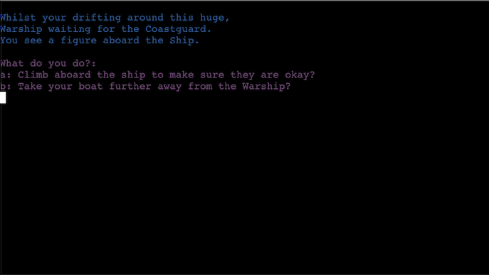
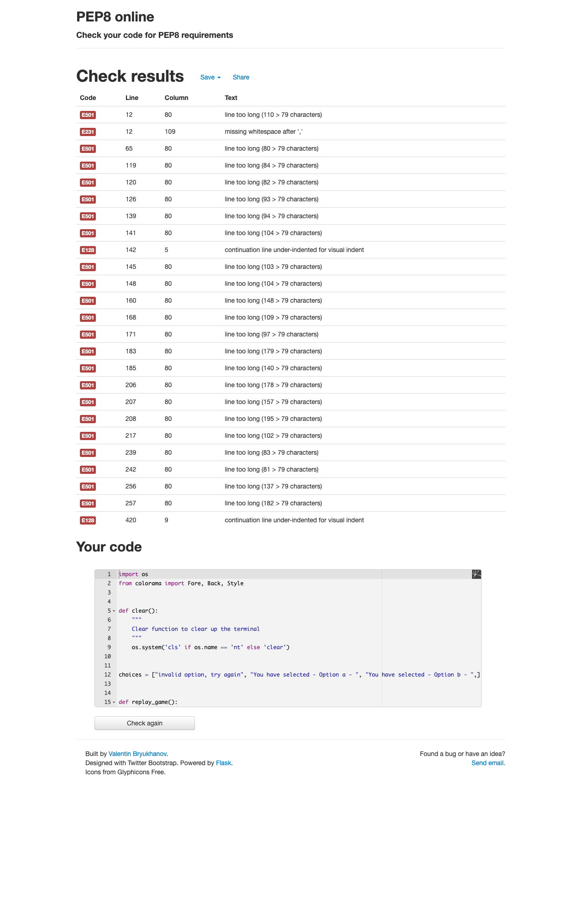
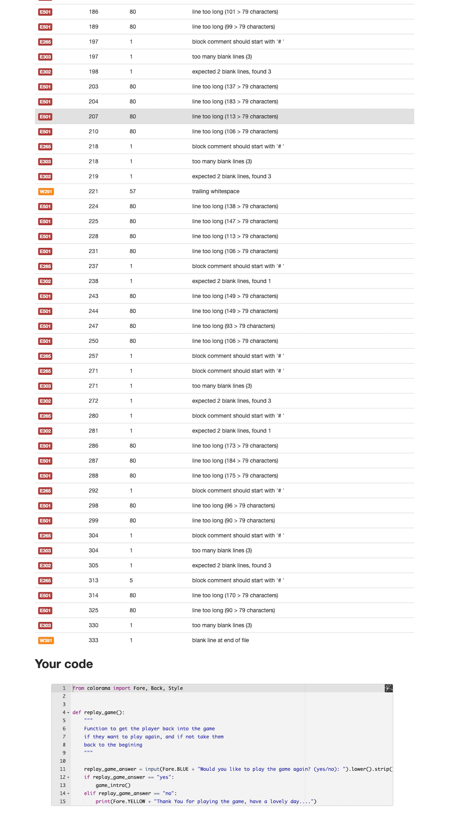
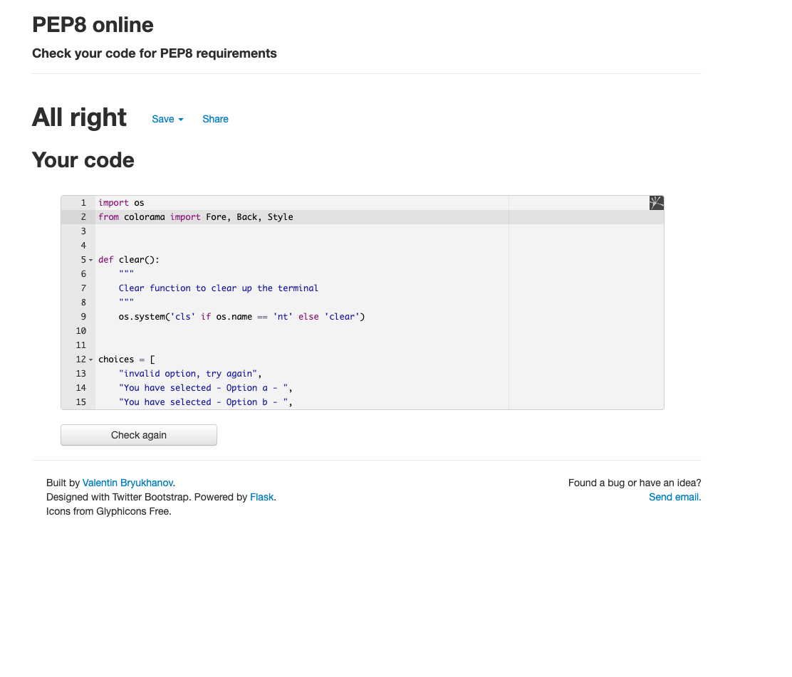
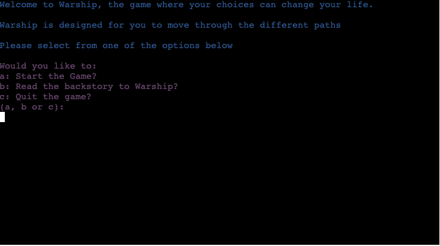

# Warship Testing

Warship has been tested both in the terminal in [Gitpod](https://www.gitpod.io), and the Code Institute [Heroku terminal](https://warship-app.herokuapp.com/).

Whilst testing the playability of the game, an error that has come up was that the terminal would fill very quickly.

To overcome the terminal filling-up with commands, the `clear()` function was added to the game.

```python
import os

def clear():
    """
    Clear function to clear up the terminal
    """
    os.system('cls' if os.name == 'nt' else 'clear')
```



I have manually tested this project by doing the following:

* Passed the code through a PEP8 linter and confirmed there are no outstanding problems.
* Given invalid inputs: strings when numbers are expected, out of bounds inputs, same input twice, etc.
* Tested in my local terminal, and the Code Institute Heroku terminal

## Bugs

### Solved Bugs

* When I wrote the project, I was getting errors that where linked to functions not calling due to indentation errors.
* My `replay_game()` function was not calling due to an error with the `if` statement, as I was calling an `else` clause instead of an `elif` statement first.

### Remaining Bugs

* No bugs remaining, that I'm aware of.

### Validator Testing

* [PEP8](http://pep8online.com/) - Python tests were checked using PEP8online.com
    * **BEFORE VALIDATION** - Errors were returned from PEP8online.com
	
    * **STARTING TO FIX VALIDATION** - Multiple errors were returned from PEP8online.com
    
    * **VALIDATION COMPLETE** - No errors were returned from PEP8online.com
    

## Issues

* Layout of the game - fixed with the aforementioned PEP8 guidelines for the length of the command line being less than 79chars.
* Indentation - during the build of the game, indentation errors caused problems with the game running.

## Testing Features

*  colorama colors display in terminal
    - 

* reading the backstory of Warship

    - 

* the `clear()` function clears up the screen to avoid clogging the terminal

    - 

* Errors handling for user inputs

    - 
